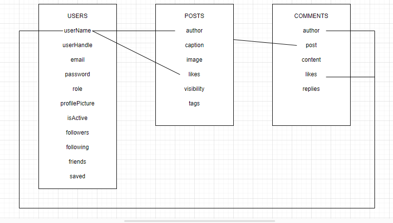

# Twittagram

### IMPORTANT

- The IDs referenced in the thunder collections are an example and do not represent real IDs. The following IDs ARE REAL.

- Random userId 65f9f41f0f53bbfb5564d6fe 
- Random postId 65f9f4290f53bbfb5564d7f8
- Random commentId 65f9f42a0f53bbfb5564d8c0

<details>
  <summary>Content 📝</summary>
  <ol>
    <li><a href="#about-the-project">About the project</a></li>
    <li><a href="#goal">Goal</a></li>
    <li><a href="#deployment-🚀">Deployment</a></li>
    <li><a href="#stack">Stack</a></li>
    <li><a href="#local-installation">Installation</a></li>
    <li><a href="#diagram">Diagram</a></li>
    <li><a href="#endpoints">Endpoints</a></li>
    <li><a href="#decisions">Decisions</a></li>
    <li><a href="#roadmap">Roadmap</a></li>
    <li><a href="#author">Authort</a></li>
  </ol>
</details>

## About the project
This was the fifth project for an FSD bootcamp at GeeksHubs Academy. The project consisted in making a backend app with both the api and the database for a social media using mongo, mongoose and js.    

## Goal
The project required us to make a database in mongodb and a minimum of two collections, users and posts. 

This had to be connected to the api and the api was required to include at least the following endpoints: 

- POST /api/auth/register 
- POST /api/auth/login

- GET /api/users
- GET /api/users/profile
- PUT /api/users/profile

- POST /api/posts
- PUT /api/posts
- GET /api/posts/{id}
- GET /api/posts
- GET /api/posts/own
- GET /api/users/posts/{user-id}
- DELETE /api/posts/{id}

## Deployment 🚀
<div align="center">
    API address = https://twittagram-dev-pajn.2.ie-1.fl0.io
</div>

## Stack
Technologies employed:
<div align="center">
<a href="https://www.mongodb.com/">
    
</a>
<a href="https://www.expressjs.com/">
    
</a>
<a href="https://nodejs.org/es/">
    
</a>
<a href="https://developer.mozilla.org/es/docs/Web/JavaScript">
    
</a>
 </div>


## Installation
1. Clone the repo: ` $ git clone https://github.com/Eryhnar/twittagram/tree/master`
2. ` $ npm install `
3. Create a mondodb database. I recommend using docker for this step.
4. Set the .env file and adjust the params for the database.
5. Connect to the database. If the .env is set properly, executing the following command within the ide console will connect to the database ``` $ npm run dev ```
6. Import the routes from the thunder routes collection folder.

## Diagram


## Endpoints
<details>
<summary>Endpoints</summary>
    
    
### Register

**Endpoint:** `/api/auth/register`

**Method:** `POST`

**Description:** This endpoint allows a user to register.

**Headers:**

- none

**Request Body:**

- `userName`: Any combination of numbers and letters between 3-20 chars. Can include . _ - in any position past the first one. It will remove spaces and will turn to lowercase but accepts both in entry.
- `email`: something@something.domain
- `password`: minimum one capital letter, one lowercase and a number. Length 8-14. Accepts . - _

**Responses:**

- `201 OK`
- `400 Bad Request`
- `500 Internal Server Error`

**Example Request:**

```json
{
    "userName": "michael", 
    "email": "michael@michael.com", 
    "password": "princess"
}
```
**Example Response:** 
```json
{
    "success": true,
    "message": "User registered successfully"
}
```
### Log in

**Endpoint:** `/api/auth/login`

**Method:** `POST`

**Description:** This endpoint allows a user to log in.

**Headers:**

- none

**Request Body:**

- `email`: something@something.domain
- `password`: minimum one capital letter, one lowercase and a number. Length 8-14. Accepts . - _

**Responses:**

- `200 OK`
- `400 Bad Request`
- `404 Not Found`
- `500 Internal Server Error`

**Example Request:**

```json
{
    "email": "michael@michael.com", 
    "password": "princess"
}
```
**Example Response:** 
```json
{
    "success": true,
    "message": "User  successfully"
}
```
### Get Users

**Endpoint:** `/api/users/`

**Method:** `GET`

**Description:** This endpoint a super admin to recover all users.

**Headers:**

- token

**Request Body:**

- none

**Responses:**

- `200 OK`
- `400 Bad Request`
- `500 Internal Server Error`

**Optional Queries:**

- page
- userName
- userHandle
- email
- role
- isActive

**Example Response:** 
```json
{
    "success": true,
    "message": "Users retrieved successfully "
}
```

### Get User Profile

**Endpoint:** `/api/users/profile`

**Method:** `GET`

**Description:** This endpoint allows a user to retrieve their profile information.

**Headers:**

- `Authorization`: Bearer token for authenticating the user. This should be included in all requests to this endpoint.

**Example Headers:**

```json
{
    "Authorization": "Bearer your_token_here"
}
```

**Responses:**

- `200 OK: The profile information was successfully retrieved. Returns the user's profile data.`
- `401 Unauthorized: The user is not authenticated. Returns an error message.`
- `500 Internal Server Error: An error occurred on the server while trying to retrieve the profile information. Returns an error message.`

**Example Response:**
``` js
{
    "success": true,
    "message": "User profile retrieved successfully",
    "data": user
}
```

### Update User Profile

**Endpoint:** `/api/users/profile`

**Method:** `PUT`

**Description:** This endpoint allows users to update their profile information.

**Headers:**

- `Authorization`: Bearer token for user authentication. This token must be included in the headers of the request.

**Example Headers:**

```json
{
    "Authorization": "Bearer your_token_here"
}
```

**Request Body:**

- `userName` (string, optional): New username.
- `email` (string, optional): New email address.
- `bio` (string, optional): New biography.
- `profilePicture` (string, optional): URL of the new profile picture.

**Example Request Body:**
```json
{
    "userName": "new_username",
    "email": "new_email@example.com",
    "bio": "New biography",
    "profilePicture": "https://example.com/new_profile_picture.jpg"
}
```
**Responses:**

- `200 OK:` The profile was successfully updated. Returns the updated user profile data.
- `400 Bad Request:` The request body is invalid or missing required fields. Returns an error message detailing the issue.
- `401 Unauthorized:` The user is not authenticated. Returns an error message.
- `500 Internal Server Error:` An error occurred on the server while trying to update the profile. Returns an error message.

### Update User Password

**Endpoint:** `/api/users/profile/password`

**Method:** `PUT`

**Description:** This endpoint allows a user to update their password.

**Headers:**

- `Authorization`: Bearer token for authenticating the user. This should be included in all requests to this endpoint.

**Example Headers:**

```json
{
    "Authorization": "Bearer your_token_here"
}
```
**Request Body:**

- `oldPassword:` The user's current password.
- `newPassword:` The user's new password.
- `newPasswordRepeat:` Confirmation of the user's new password.

**Responses:**

- `200 OK:` The password was successfully updated. Returns a success message.
- `400 Bad Request:` The new passwords do not match, the old password is incorrect, or the password does not meet the required criteria. Returns an error message.
- `401 Unauthorized:` The user is not authenticated or the old password is incorrect. Returns an error message.
- `500 Internal Server Error:` An error occurred on the server while trying to update the password. Returns an error message.

**Example Request:**

```json
{
    "oldPassword": "oldPassword123",
    "newPassword": "newPassword123",
    "newPasswordRepeat": "newPassword123"
}
```
**Example Response:**
```json
{
    "success": true,
    "message": "User password updated successfully"
}
```

### Update User by ID

**Endpoint:** `/api/users/:id`

**Method:** `PUT`

**Description:** This endpoint allows an admin to update a user's information by their ID.

**Headers:**

- `Authorization`: Bearer token for authenticating the admin. This should be included in all requests to this endpoint.

**Example Headers:**

```json
{
    "Authorization": "Bearer your_token_here"
}
```

**URL Parameters:**

- `id:` The ID of the user to update.
**Request Body:**

- `userName:` The new username for the user (optional).
- `email:` The new email for the user (optional).
- `role:` The new role for the user (optional). Must be one of user, admin, or superadmin.
- `isActive:` The new active status for the user (optional). Must be a boolean.
- `bio:` The new bio for the user (optional).
- `profilePicture:` The new profile picture URL for the user (optional).
**Responses:**

- `200 OK:` The user was successfully updated. Returns the updated user data.
- `400 Bad Request:` The provided username, email, role, active status, bio, or profile picture URL is invalid, or the user ID is invalid. Returns an error message.
- `401 Unauthorized:` The admin is not authenticated. Returns an error message.
- `404 Not Found:` The user with the provided ID was not found. Returns an error message.
- `500 Internal Server Error:` An error occurred on the server while trying to update the user. Returns an error message.

**Example Request:**
all fields are optional for updates.
```json
{
    "userName": "new_username",
    "email": "new_email@example.com",
    "role": "user",
    "isActive": true,
    "bio": "This is my new bio",
    "profilePicture": "https://example.com/new_profile_picture.jpg"
}
```
***Example Response:**
```js
{
    "success": true,
    "message": "User updated successfully",
    "data": user
    
}
```

### Delete User by ID

**Endpoint:** `/api/users/:id`

**Method:** `DELETE`

**Description:** This endpoint allows an admin to delete a user by their ID.

**Headers:**

- `Authorization`: Bearer token for authenticating the admin. This should be included in all requests to this endpoint.

**Example Headers:**

```json
{
    "Authorization": "Bearer your_token_here"
}
```

**URL Parameters:**

- `id:` The ID of the user to delete.
**Responses:**

- `200 OK:` The user was successfully deleted. Returns a success message.
- `400 Bad Request:` The user ID is invalid. Returns an error message.
- `401 Unauthorized:` The admin is not authenticated. Returns an error message.
- `404 Not Found:` The user with the provided ID was not found. Returns an error message.
- `500 Internal Server Error:` An error occurred on the server while trying to delete the user. Returns an error message.
**Example Response:**
```json
{
    "success": true,
    "message": "User deleted successfully"
}
```

### Deactivate User Profile

**Endpoint:** `/api/users/profile/deactivate`

**Method:** `PUT`

**Description:** This endpoint allows a user to deactivate their profile.

**Headers:**

- `Authorization`: Bearer token for authenticating the user. This should be included in all requests to this endpoint.

**Example Headers:**

```json
{
    "Authorization": "Bearer your_token_here"
}
```

**Request Body:**

- `password:` The user's current password. This is required to confirm the deactivation.
**Responses:**

- `200 OK:` The profile was successfully deactivated. Returns a success message.
- `400 Bad Request:` The provided password is incorrect. Returns an error message.
- `401 Unauthorized:` The user is not authenticated. Returns an error message.
- `404 Not Found:` The user was not found. Returns an error message.
- `500 Internal Server Error:` An error occurred on the server while trying to deactivate the profile. Returns an error message.
**Example Request:**
```json
{
    "password": "currentPassword123"
}
```

### Get Posts by User ID

**Endpoint:** `/api/users/posts/:id`

**Method:** `GET`

**Description:** This endpoint allows a user to retrieve all posts made by a specific user, identified by their ID.

**Headers:**

- `Authorization`: Bearer token for authenticating the user. This should be included in all requests to this endpoint.

**Example Headers:**

```json
{
    "Authorization": "Bearer your_token_here"
}
```

**URL Parameters:**

- `id:` The ID of the user whose posts are to be retrieved.
**Query Parameters:**

- `page:` The page number to return (optional).

**Responses:**

- `200 OK:` The posts were successfully retrieved. Returns the posts data.
- `400 Bad Request:` The provided user ID, limit, skip, or page number is invalid. Returns an error message.
- `401 Unauthorized:` The user is not authenticated. Returns an error message.
- `500 Internal Server Error:` An error occurred on the server while trying to retrieve the posts. Returns an error message.

### Get Saved Posts by User

**Endpoint:** `/api/users/saved`

**Method:** `GET`

**Description:** This endpoint allows a user to retrieve all posts they have saved.

**Headers:**

- `Authorization`: Bearer token for authenticating the user. This should be included in all requests to this endpoint.

**Example Headers:**

```json
{
    "Authorization": "Bearer your_token_here"
}
```

**Query Parameters:**

- `page:` The page number to return (optional).

**Responses:**

- `200 OK:` The posts were successfully retrieved. Returns the posts data.
- `400 Bad Request:` The provided limit, skip, or page number is invalid. Returns an error message.
- `401 Unauthorized:` The user is not authenticated. Returns an error message.
- `500 Internal Server Error:` An error occurred on the server while trying to retrieve the posts. Returns an error message.

### Toggle Follow User

**Endpoint:** `/api/users/follow`

**Method:** `PUT`

**Description:** This endpoint allows a user to follow or unfollow another user.

**Headers:**

- `Authorization`: Bearer token for authenticating the user. This should be included in all requests to this endpoint.

**Example Headers:**

```json
{
    "Authorization": "Bearer your_token_here"
}
```

**Request Body:**

- `targetUserId:` The ID of the user to follow or unfollow.
**Responses:**

- `200 OK:` The follow/unfollow operation was successful. Returns the updated user data.
- `400 Bad Request:` The provided targetUserId is invalid. Returns an error message.
- `401 Unauthorized:` The user is not authenticated. Returns an error message.
- `404 Not Found:` The user with the provided targetUserId was not found. Returns an error message.
- `500 Internal Server Error:` An error occurred on the server while trying to follow/unfollow the user. Returns an error message.
**Example Request:**
```json
{
    "targetUserId": "123"
}
```

### Get Timeline Posts

**Endpoint:** `/api/posts/timeline`

**Method:** `GET`

**Description:** This endpoint allows a user to retrieve posts from users they are following, sorted by creation date in descending order.

**Headers:**

- `Authorization`: Bearer token for authenticating the user. This should be included in all requests to this endpoint.

**Example Headers:**

```json
{
    "Authorization": "Bearer your_token_here"
}
```

**Query Parameters:**

- `page:` The page number to return (optional).
**Responses:**

- `200 OK:` The posts were successfully retrieved. Returns the posts data.
- `400 Bad Request:` The provided limit, skip, or page number is invalid. Returns an error message.
- `401 Unauthorized:` The user is not authenticated. Returns an error message.
- `500 Internal Server Error:` An error occurred on the server while trying to retrieve the posts. Returns an error message.

### Get All Posts

**Endpoint:** `/api/posts/`

**Method:** `GET`

**Description:** This endpoint allows a user to retrieve all posts, sorted by creation date in descending order.

**Headers:**

- `Authorization`: Bearer token for authenticating the user. This should be included in all requests to this endpoint.

**Example Headers:**

```json
{
    "Authorization": "Bearer your_token_here"
}
```

**Query Parameters:**

- `page:` The page number to return (optional).
**Responses:**

- `200 OK:` The posts were successfully retrieved. Returns the posts data.
- `400 Bad Request:` The provided limit, skip, or page number is invalid. Returns an error message.
- `401 Unauthorized:` The user is not authenticated. Returns an error message.
- `500 Internal Server Error:` An error occurred on the server while trying to retrieve the posts. Returns an error message.

### Create a New Post

**Endpoint:** `/api/posts/`

**Method:** `POST`

**Description:** This endpoint allows a user to create a new post.

**Headers:**

- `Authorization`: Bearer token for authenticating the user. This should be included in all requests to this endpoint.

**Example Headers:**

```json
{
    "Authorization": "Bearer your_token_here"
}
```

**Request Body:**

- `image:` The URL of the image for the post. This is required.
- `caption:` The caption of the post (optional).
- `visibility:` The visibility of the post (optional).
- `tags:` An array of tags for the post (optional).
**Responses:**

- `201 Created:` The post was successfully created. Returns the created post data.
- `400 Bad Request:` The provided image URL, caption, visibility, or tags are invalid. Returns an error message.
- `401 Unauthorized:` The user is not authenticated. Returns an error message.
- `500 Internal Server Error:` An error occurred on the server while trying to create the post. Returns an error message.
**Example Request:**
```json
{
    "image": "https://example.com/image.jpg",
    "caption": "This is a caption",
    "visibility": "public",
    "tags": ["tag1", "tag2"]
}
```

### Update a Post

**Endpoint:** `/api/posts/`

**Method:** `PUT`

**Description:** This endpoint allows a user to update an existing post.

**Headers:**

- `Authorization`: Bearer token for authenticating the user. This should be included in all requests to this endpoint.

**Example Headers:**

```json
{
    "Authorization": "Bearer your_token_here"
}
```

**Request Body:**

- `postId:` The ID of the post to update. This is required.
- `caption:` The new caption of the post (optional).
- `visibility:` The new visibility of the post (optional).
- `tags:` An array of new tags for the post (optional).
**Responses:**

- `200 OK:` The post was successfully updated. Returns the updated post data.
- `400 Bad Request:` The provided postId, caption, visibility, or tags are invalid, or the post was not found. Returns an error message.
- `401 Unauthorized:` The user is not authenticated, or the user is not the author of the post. Returns an error message.
- `500 Internal Server Error:` An error occurred on the server while trying to update the post. Returns an error message.
**Example Request:**
```json
{
    "postId": "123",
    "caption": "This is a new caption",
    "visibility": "private",
    "tags": ["newTag1", "newTag2"]
}
```

### Get Own Posts

**Endpoint:** `/api/posts/own`

**Method:** `GET`

**Description:** This endpoint allows a user to retrieve their own posts, sorted by creation date in descending order.

**Headers:**

- `Authorization`: Bearer token for authenticating the user. This should be included in all requests to this endpoint.

**Example Headers:**

```json
{
    "Authorization": "Bearer your_token_here"
}
```

**Query Parameters:**

- `page:` The page number to return (optional).
**Responses:**

- `200 OK:` The posts were successfully retrieved. Returns the posts data.
- `400 Bad Request:` The provided limit, skip, or page number is invalid. Returns an error message.
- `401 Unauthorized:` The user is not authenticated. Returns an error message.
- `500 Internal Server Error:` An error occurred on the server while trying to retrieve the posts. Returns an error message.

### Get a Post by ID

**Endpoint:** `/api/posts/:id`

**Method:** `GET`

**Description:** This endpoint allows a user to retrieve a specific post by its ID, provided the post's visibility is set to "public".

**Headers:**

- `Authorization`: Bearer token for authenticating the user. This should be included in all requests to this endpoint.

**Example Headers:**

```json
{
    "Authorization": "Bearer your_token_here"
}
```

**Path Parameters:**

- `id:` The ID of the post to retrieve.
**Responses:**

- `200 OK:` The post was successfully retrieved. Returns the post data.
- `400 Bad Request:` The provided ID is invalid. Returns an error message.
- `401 Unauthorized:` The user is not authenticated. Returns an error message.
- `404 Not Found:` The post with the provided ID was not found, or the post's visibility is not set to "public". Returns an error message.
- `500 Internal Server Error:` An error occurred on the server while trying to retrieve the post. Returns an error message.

### Delete a Post by ID

**Endpoint:** `/api/posts/:id`

**Method:** `DELETE`

**Description:** This endpoint allows a user to delete a specific post by its ID, provided they are the author of the post.

**Headers:**

- `Authorization`: Bearer token for authenticating the user. This should be included in all requests to this endpoint.

**Example Headers:**

```json
{
    "Authorization": "Bearer your_token_here"
}
```

**Path Parameters:**

- `id:` The ID of the post to delete.
**Responses:**

- `200 OK:` The post was successfully deleted. Returns a success message.
- `400 Bad Request:` The provided ID is invalid. Returns an error message.
- `401 Unauthorized:` The user is not authenticated, or the user is not the author of the post. Returns an error message.
- `404 Not Found:` The post with the provided ID was not found. Returns an error message.
- `500 Internal Server Error:` An error occurred on the server while trying to delete the post. Returns an error message.

### Like or Unlike a Post

**Endpoint:** `/api/posts/like`

**Method:** `PUT`

**Description:** This endpoint allows a user to like or unlike a specific post.

**Headers:**

- `Authorization`: Bearer token for authenticating the user. This should be included in all requests to this endpoint.

**Example Headers:**

```json
{
    "Authorization": "Bearer your_token_here"
}
```

**Request Body:**

- `postId:` The ID of the post to like or unlike. This is required.
**Responses:**

- `200 OK:` The post was successfully liked or unliked. Returns the updated post data.
- `400 Bad Request:` The provided postId is invalid, or the post was not found. Returns an error message.
- `401 Unauthorized:` The user is not authenticated. Returns an error message.
- `500 Internal Server Error:` An error occurred on the server while trying to like or unlike the post. Returns an error message.
**Example Request:**
```json
{
    "postId": "123"
}
```

### Save or Unsave a Post

**Endpoint:** `/api/posts/save`

**Method:** `PUT`

**Description:** This endpoint allows a user to save or unsave a post.

**Headers:**

- `Authorization`: Bearer token for authenticating the user. This should be included in all requests to this endpoint.

**Example Headers:**

```json
{
    "Authorization": "Bearer your_token_here"
}
```

**Request Body:**

- `postId:` The ID of the post to save or unsave. This is required.
**Responses:**

- `200 OK:` The post was successfully saved or unsaved. Returns the updated user profile data.
- `400 Bad Request:` The provided postId is invalid, or the post was not found. Returns an error message.
- `401 Unauthorized:` The user is not authenticated. Returns an error message.
- `500 Internal Server Error:` An error occurred on the server while trying to save or unsave the post. Returns an error message.
**Example Request:**
```json
{
    "postId": "123"
}
```

### Post a Comment

**Endpoint:** `/api/comments/`

**Method:** `POST`

**Description:** This endpoint allows a user to post a comment on a specific post.

**Headers:**

- `Authorization`: Bearer token for authenticating the user. This should be included in all requests to this endpoint.

**Example Headers:**

```json
{
    "Authorization": "Bearer your_token_here"
}
```

**Request Body:**

- `postId:` The ID of the post to comment on. This is required.
- `content:` The content of the comment. This is required.
**Responses:**

- `200 OK:` The comment was successfully posted. Returns the comment data.
- `400 Bad Request:` The provided postId or content is invalid, or the post was not found. Returns an error message.
- `401 Unauthorized:` The user is not authenticated. Returns an error message.
- `500 Internal Server Error:` An error occurred on the server while trying to post the comment. Returns an error message.
**Example Request:**
```json
{
    "postId": "123", //this must be a mongoose id object, not like this
    "content": "This is a comment"
}
```

### Post a Reply to a Comment

**Endpoint:** `/api/comments/reply`

**Method:** `POST`

**Description:** This endpoint allows a user to post a reply to a comment on a post.

**Headers:**

- `Authorization`: Bearer token for authenticating the user. This should be included in all requests to this endpoint.

**Example Headers:**

```json
{
    "Authorization": "Bearer your_token_here"
}
```

**Request Body:**

- `postId:` The ID of the post the comment belongs to. This is required.
- `commentId:` The ID of the comment to reply to. This is required.
- `content:` The content of the reply. This is required.
**Responses:**

- `200 OK:` The reply was successfully posted. Returns the updated comment data.
- `400 Bad Request:` The provided postId, commentId, or content is invalid, or the post or comment was not found. Returns an error message.
- `401 Unauthorized:` The user is not authenticated. Returns an error message.
- `404 Not Found:` Comment was not found. 
- `500 Internal Server Error:` An error occurred on the server while trying to post the reply. Returns an error message.
**Example Request:**
```json
{
    "postId": "123",
    "commentId": "456",
    "content": "This is a reply"
}
```

### Delete a Comment

**Endpoint:** `/api/comment/delete`

**Method:** `PUT`

**Description:** This endpoint allows a user to delete a comment on a post. Instead of completely removing the comment, it updates the content to "This comment has been deleted".

**Headers:**

- `Authorization`: Bearer token for authenticating the user. This should be included in all requests to this endpoint.

**Example Headers:**

```json
{
    "Authorization": "Bearer your_token_here"
}
```

**Request Body:**

postId: The ID of the post the comment belongs to. This is required.
commentId: The ID of the comment to delete. This is required.
**Responses:**

- `200 OK:` The comment was successfully deleted. Returns the updated comment data.
- `400 Bad Request:` The provided postId or commentId is invalid, or the post or comment was not found. Returns an error message.
- `401 Unauthorized:` The user is not authenticated, or the user is not the author of the comment. Returns an error message.
- `404 Not Found:` Comment was not found.
- `500 Internal Server Error:` An error occurred on the server while trying to delete the comment. Returns an error message.
**Example Request:**
```json
{
    "postId": "123", // This must be a mongoose object id
    "commentId": "456" // This must be a mongoose object id
}
```

### Like or Unlike a Comment

**Endpoint:** `/api/comments/like`

**Method:** `PUT`

**Description:** This endpoint allows a user to like or unlike a comment.

**Headers:**

- `Authorization`: Bearer token for authenticating the user. This should be included in all requests to this endpoint.

**Example Headers:**

```json
{
    "Authorization": "Bearer your_token_here"
}
```

**Request Body:**

- `commentId:` The ID of the comment to like or unlike. This is required.
- `postId:` The ID of the post the comment belongs to. This is required.
**Responses:**

- `200 OK:` The comment was successfully liked or unliked. Returns the updated comment data.
- `400 Bad Request:` The provided commentId or postId is invalid, or the comment was not found. Returns an error message.
- `401 Unauthorized:` The user is not authenticated. Returns an error message.
- `404 Not Found:` The comment with the provided commentId was not found. Returns an error message.
- `500 Internal Server Error:` An error occurred on the server while trying to like or unlike the comment. Returns an error message.
**Example Request:**
```json
{
    "postId": "123", // This must be a mongoose object id
    "commentId": "456" // This must be a mongoose object id
}
```

### Update a Comment

**Endpoint:** `/api/comments`

**Method:** `PUT`

**Description:** This endpoint allows a user to update the content of a comment they authored.

**Headers:**

- `Authorization`: Bearer token for authenticating the user. This should be included in all requests to this endpoint.

**Example Headers:**

```json
{
    "Authorization": "Bearer your_token_here"
}
```

**Request Body:**

- `commentId:` The ID of the comment to update. This is required.
- `postId:` The ID of the post the comment belongs to. This is required.
- `content:` The new content of the comment. This is required.
**Responses:**

- `200 OK:` The comment was successfully updated. Returns the updated comment data.
- `400 Bad Request:` The provided commentId, postId, or content is invalid, or the comment was not found. Returns an error message.
- `401 Unauthorized:` The user is not authenticated, or the user is not the author of the comment. Returns an error message.
- `404 Not Found:` The comment with the provided commentId was not found. Returns an error message.
- `500 Internal Server Error:` An error occurred on the server while trying to update the comment. Returns an error message.
**Example Request:**
```json
{
    "postId": "123", // This must be a mongoose object id
    "commentId": "456", // This must be a mongoose object id
    "content": "This is the updated content"
}
```

</details>

## Credentials
    These are some of the credentials provided in the seeder.
    - user@user.com password: Aa123456 user
    - admin@admin.com password: Aa123456 admin
    - super_admin@super_admin.com password: Aa123456 super_admin

## Decisions

- I decided to take an approach where I avoid denormalizing the database as I think it is unnecessary but I have indexed the fields that are used in queries to speed up fetches considering the drawback in an api like this are acceptable.

## Roadmap
- Implement aggregate fetches for complex fetches.
- Review code to unify some parts where functions still keep the old approach.
- Abstract auth into service and repository.
- Clean up code.
- Add testing.
- Complete seeders so that they include saved in users and replies in comments.

## Author 

- **Pedro Fernández** - Project Developer
  - [GitHub](https://github.com/Eryhnar) - [LinkedIn](https://www.linkedin.com/in/pedro-fernandez-bel-68a2b9155/)